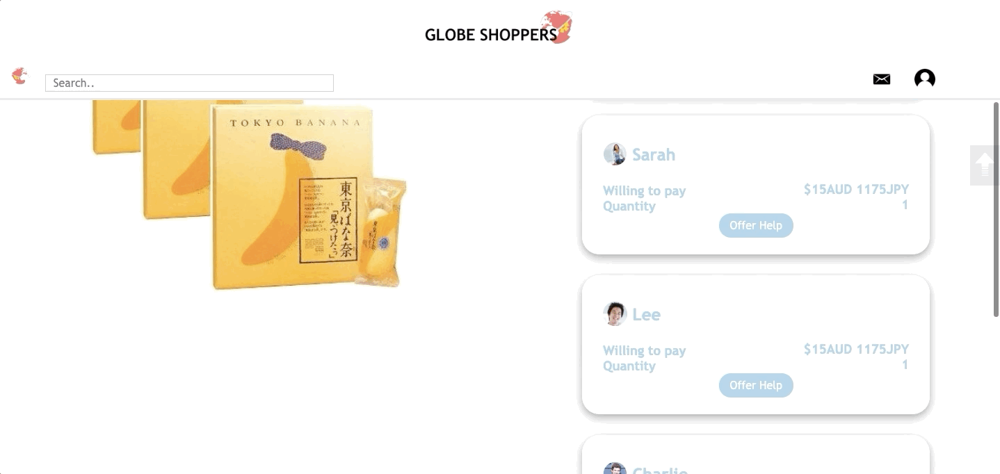
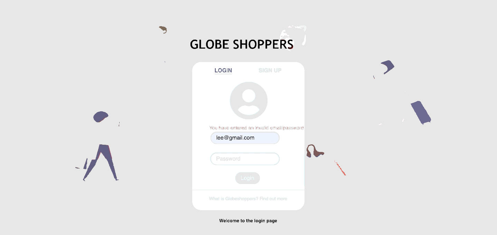
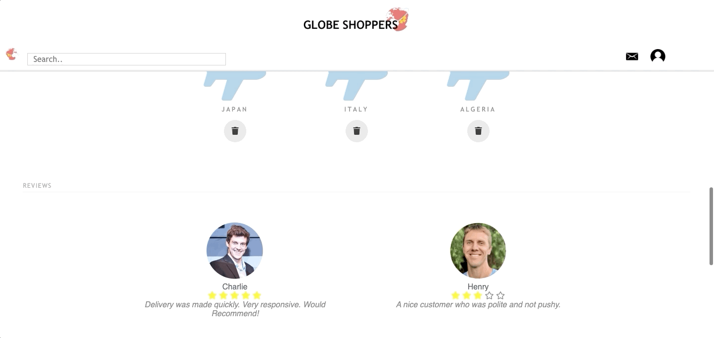

# GlobeShopper
An online marketplace which connects travellers to customers who want items overseas but are unable to travel themselves. This project/idea was pitched at UNSW PFC 2019 (a start-up competition), and was selected to be in the Top 12. It originated from a course assignment which had to utilise an API (eBay API). This project was created using json for database, python and flask for backend and server, with javascript, html and css for frontend. My responsibilities consisted mostly of backend, for example handing and integrating API calls, search function, categories,  reviews and ratings and inbox including automated messages. I also designed the background for the login and sign up pages. 

## Instructions
1. Download the Repository
2. Open the terminal and switch to the folder Website in the repository
3. Run the command python3 run.py and open the link in the browser

## Demonstration

